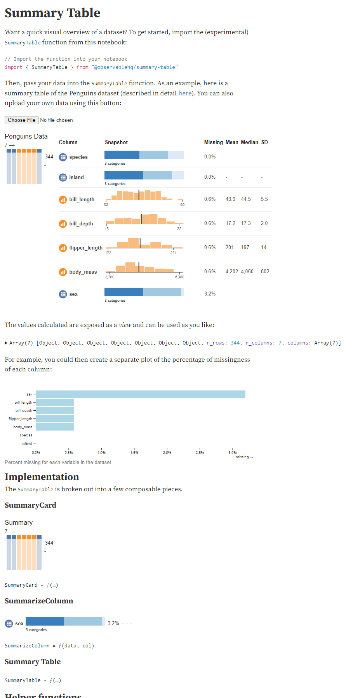

# @hpcc-js/observablehq-compiler

An unofficial compiler, interpreter and download tool for [Observable HQ](https://observablehq.com/) notebooks.

* [Quick Start](#quick-start)
* [Compiler](./src/compiler)
* [Utilities](./src/util)

## Quick Start

This library contains a command line tool (`ojscc`) for downloading and compiling notebooks and an interpreter for rendering notebooks in the browser:
* [Command line interface](#command-line-interface)
* [JS Interpreter](#js-interpreter)

## Command line interface

To call `ojscc` without installing:

```sh
npx -p @hpcc-js/observablehq-compiler ojscc [download | compile] ...
```

To install `ojscc` as a global command:
```sh
npm install --global @hpcc-js/observablehq-compiler
```

Then it can be called by:
```sh
ojscc [download | compile] ...
```

### Usage:

General:
```sh
ojscc [command]

Commands:
  ojscc download  Download ObservableHQ Notebook
  ojscc compile   Compile ObservableHQ Notebook

Options:
      --version  Show version number                                             [boolean]
  -h, --help     Show help                                                       [boolean]
```

Download:
```sh
ojscc download [-o myfile.ojsnb] https://observablehq.com/@user/notebook

Options:
      --version  Show version number                                             [boolean]
  -h, --help     Show help                                                       [boolean]
  -o, --output   Optional output file path
```

Compile:
```sh
ojscc compile [-o myfile.js] myfile.ojsnb

Options:
      --version  Show version number                                             [boolean]
  -h, --help     Show help                                                       [boolean]
  -o, --output   Optional output file path
```

## JS Interpreter

To install with npm :
```
npm install --save @hpcc-js/observablehq-compiler
```

The interpreter is 100% compatible with:
* [ObservableHQ Runtime](https://github.com/observablehq/runtime)
* [ObservableHQ Inspector](https://github.com/observablehq/inspector)
* [ObservableHQ Library](https://github.com/observablehq/library)

It also supports fetching notebooks directly from the ObservableHQ repository.

```js
import { Inspector } from "@observablehq/inspector";
import { Library } from "@observablehq/stdlib";
import { Runtime } from "@observablehq/runtime";
import { download, compile } from "@hpcc-js/observablehq-compiler";

const placeholder = document.getElementById("placeholder");

const ohqnb = await download("https://observablehq.com/@observablehq/summary-table");
const compiledNB = await compile(ohqnb);

const library = new Library();
const runtime = new Runtime(library);
compiledNB(runtime, name => {
    const div = document.createElement("div");
    placeholder.appendChild(div);
    return new Inspector(div);
});
```

Which produces (screenshot):

---



---